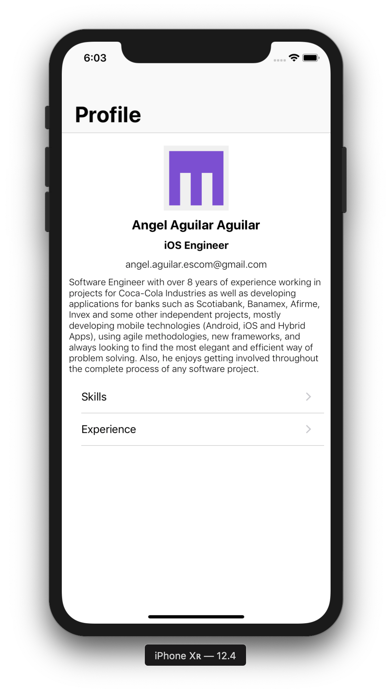
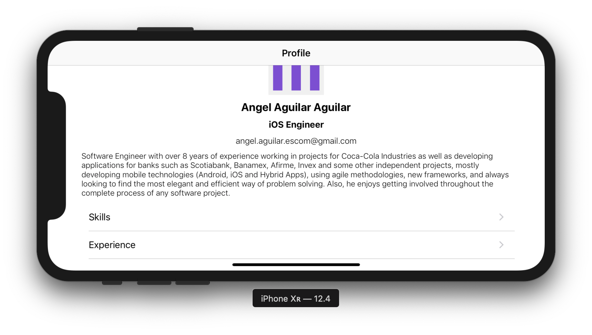
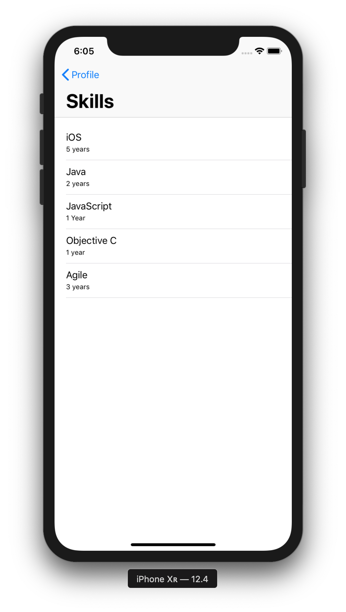
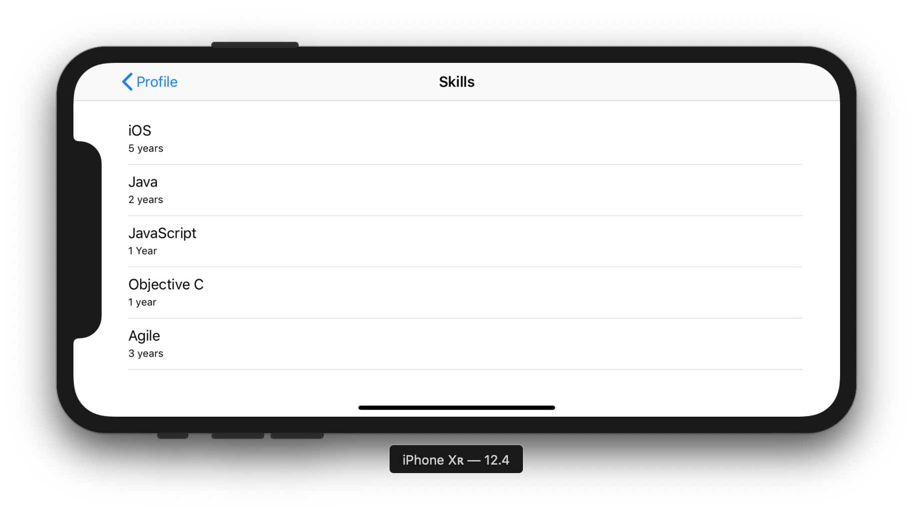
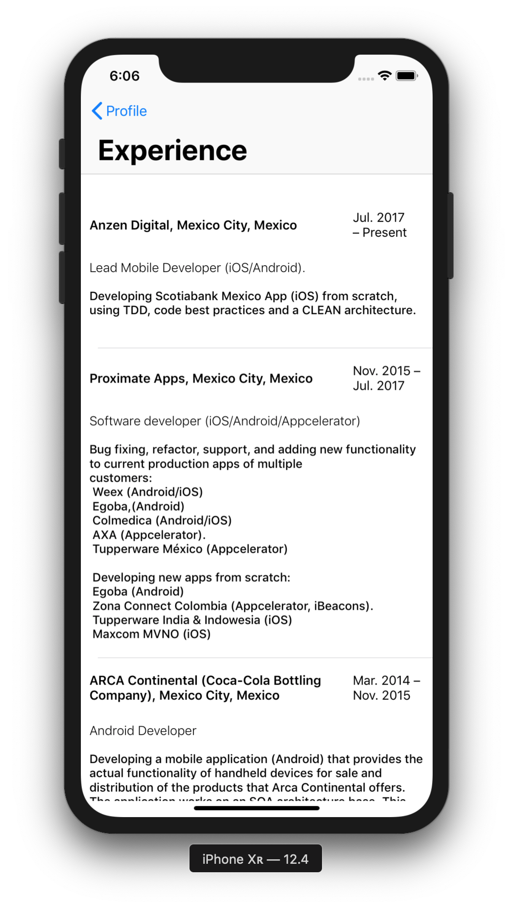
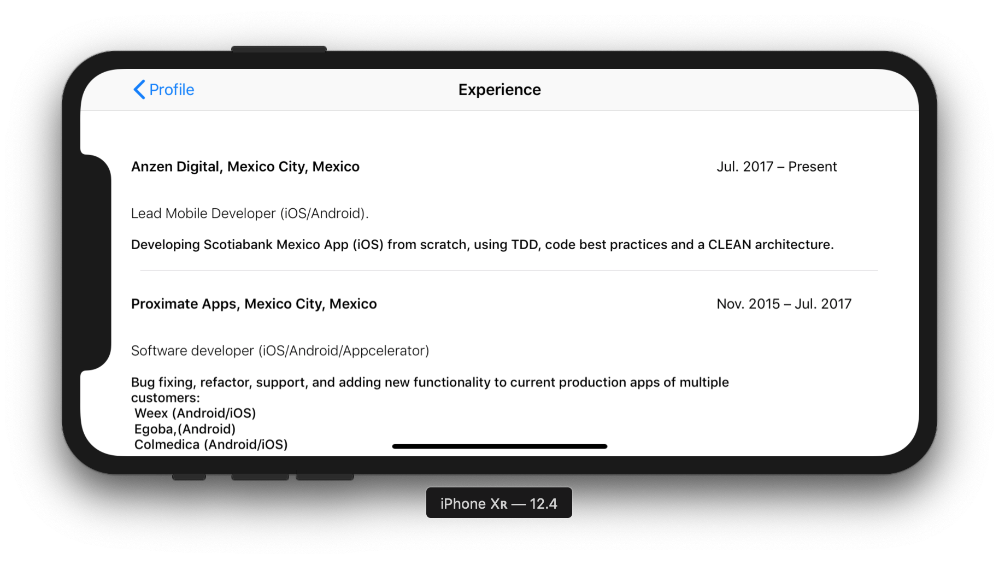

# My Curriculum iOS App

This is a demo application using VIPER architecture. You will find My Curriculum Vitae with Profile, Skills and Experience sections.

### VIPER Architecture

* ViewController: All the Views configuration and actions.
* Interactor: Manages the business logic of the application.
* Presenter:  Manages the view logic, and prepares the data for display (received from interactor), and reacts to the user inputs (updating data from the interactor). 
* Entity: The models used by the Interactor.
* Router: Manages the navigation logic of the application.

### Testing

You will find in testing that we have three main elements:

* Given: Is all the data, information or status that we need to be ready to execute an action (a bussines case, a presentation case, networking, etc)
* When: Is the action to be executed
* Then: All the results that we expect will be find here (assertions)

Every layer in the VIPER architecture is tested independently. This will help us to follow TDD in a natural way. 

### Screenshots

